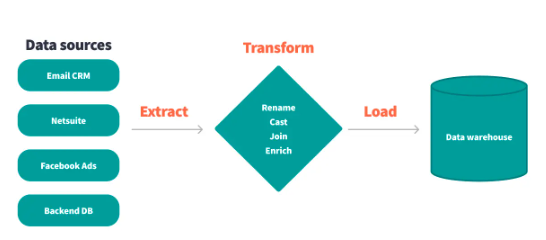
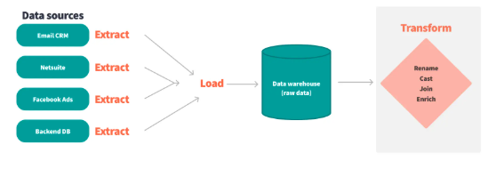
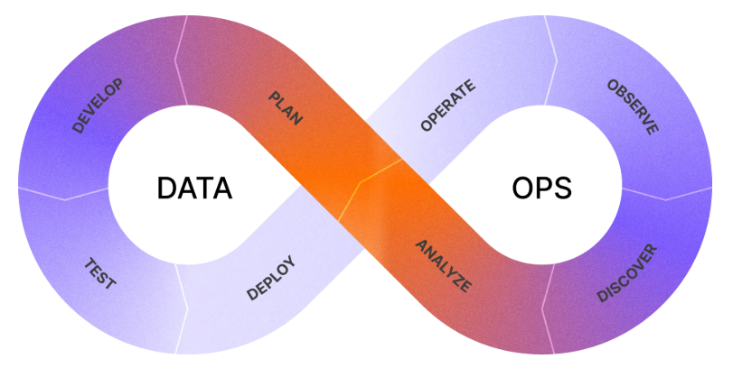
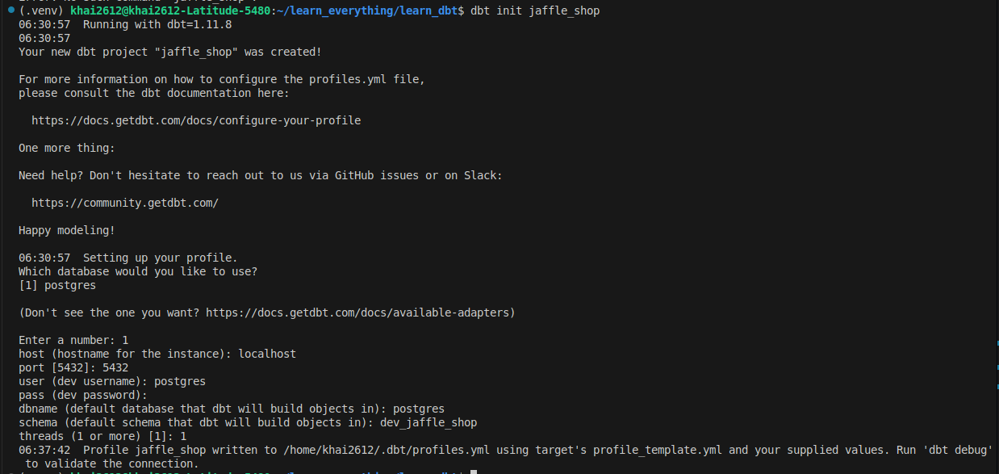
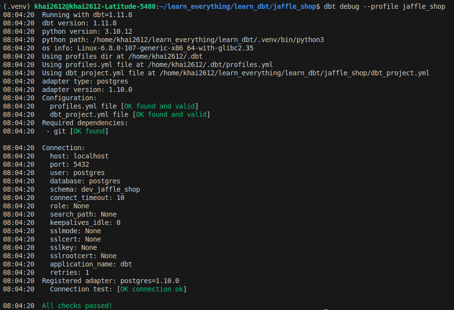
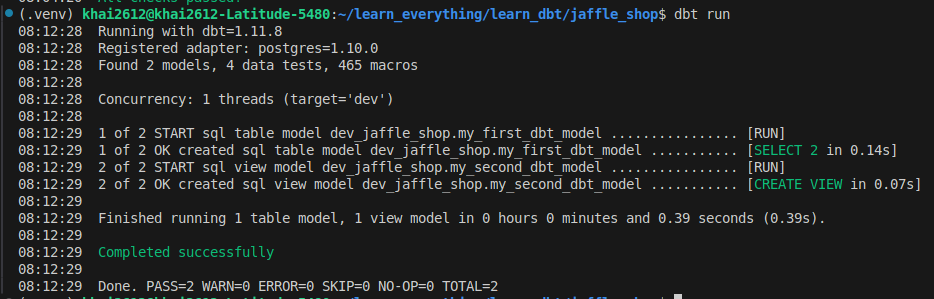
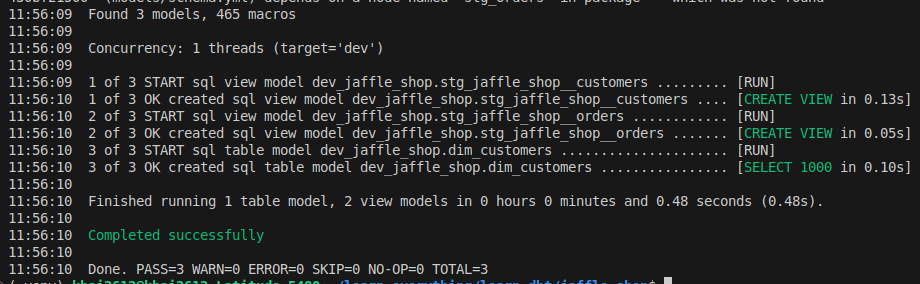
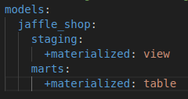
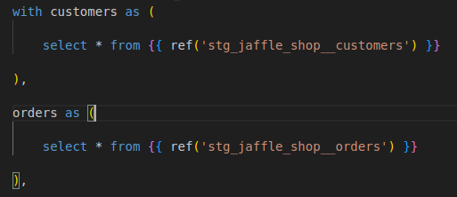

# dbt Fundamentals

## dbt and the ADLC

### ETL vs ELT: two data strategies

- **ETL - Extract, Transform, Load**

    

- **ELT - Extract, Load, Transform**

    

Benefits to using ELT over ETL
- Leverage cloud infrastructure: ELT takes advantage of the massive processing power of CDWs like Snowflake, BigQuery, and Redshift
- Faster data availability
- Cost efficiency: ELT reduces the need for expensive on-premises hardware or complex ETL tools
- Flexible, iterative transformation
- Data democratization: ELT enables analysts and data teams can access and transform data as needed without being bottlenecked by upstream ETL processes

dbt plays a crucial role in the ELT process by serving as the transformation layer within the data warehouse with dbt features
- **Version-controlled transformations**: dbt enables version control for all transformations, making it easy to track changes and collaborate across teams
- **Automation and scheduling**: With dbt, you can automate transformation processes, ensuring that the most up-to-date data is always available for analysis
- **Comprehensive testing**: dbt offers built-in testing capabilities to validate transformations, ensuring data quality and integrity throughout the ELT process

### Data Team Roles

|| Data Engineer | Analytics engineer | Data Analyst |
|:-----|:-----|:-----|:-----|
| Definition | Data engineers build systems to collect and process data (data pipeline) | Analytics engineering is a relatively recent data team role. An analytics engineer is a valuable addition to a data team | Data analysts evaluate transformed data and turn that into business insights. They answer questions using data analysis methods. Their focus is on solving business problems |
| Key roles | Designing data infrastructure and architecture<br> Creating and maintaining data pipelines<br> Ensuring data quality and availability | Exploration: Exploring data already ingested into data platforms in response to stakeholder questions and needs<br> Preparation: Cleaning and preparing datasets for analytics use cases<br> Transformation: Transforming prepared datasets into objects that can serve organizational objectives, such as a super-table that can serve as a base for multiple applications<br> Documentation: Documenting the objects they find and create in the data warehouse, ensuring that other users can also see, understand, and use them | Interpreting data to find trends<br> Creating reports and visualizations<br> Working closely with business stakeholders |

### dbt

**ADLC - Analytics Development Lifecycle**



- Provides a structured process for building, testing, reviewing, and deploying analytics
- Encourages iteration and collaboration so teams can confidently move from idea to production
- Aligns data work with software engineering best practices, such as version control, testing, and continuous improvement

**dbt as the Data Control Plane**

- dbt orchestrates and governs the ADLC across your data ecosystem
- It ensures consistency in how data is developed, tested, documented, and deployed
- By serving as the “control plane,” dbt integrates with the modern data stack to enforce trust, scalability, and readiness for AI-driven use cases

## Getting Started

In this demo, you need to set up [VSCode](https://code.visualstudio.com/download), [dbt Core](https://docs.getdbt.com/docs/local/install-dbt?version=2.0#dbt-core), a [data platform](https://docs.getdbt.com/docs/supported-data-platforms) and a Git provider, e.g., [GitHub](https://github.com/) to get started with dbt (follow to [this guide](https://docs.getdbt.com/guides/manual-install))

Here I choose **PostgreSQL** as a data platform because I'm quite familiar with it

### First Step Demo

1. `dbt init jaffle_shop`
    - Create a new dbt project named **jaffle_shop**
    - Then, you enter the information as shown in the image below

        

    - `cd jaffle_shop`
    - Two important files
        - `dbt_project.yml` file, which contains important information that tells dbt how to operate your project
        - `profiles.yml` file, which stores database connection credentials and configuration for dbt projects

2. `docker run --name postgres-dbt -e POSTGRES_USER=khai -e POSTGRES_PASSWORD=your_password -e POSTGRES_DB=raw -d -p 5432:5432 -v postgres-data:/var/lib/postgresql/data postgres:16`
    - Starting a Postgres instance with user named `khai` and database named `raw` (default to both are `postgres`)
    - `dbt debug`: test the database connection

        

3. `dbt run`
    - Run the models in the project (defined in `models/`)
    - The result looks like in below

        

4. **Commit and push the changes**

    - Create a repo on Github
    - Then, enter the following commands

        ```bash
        git init
        git branch -M main
        git add .
        git commit -m "Init a dbt project"
        git remote add origin github_repo_url
        git push -u origin main
        ```

### Build First dbt Model

**Setup**

- Check out a new git branch to work on new code: `git checkout -b add-customers-model`
- Run a setup script (ensure PostgreSQL instance is running): `python3 setup_jaffle.py`

**Run a dbt Project**

- `dbt run`

    

- Demystifying the components of dbt project

    - Each dbt model are **materialized**, which is strategies for persisting dbt models in a warehouse (e.g., view, table). Materialization configurations are defined in `dbt_project.yml`

        

    - `{{ ref() }}` macro (pieces of code that can be reused multiple times): this function defines how you reference one model within another. Here, `dim_customers.sql` refers to both `stg_jaffle_shop__customers.sql` and `stg_jaffle_shop__orders.sql`
        
        

    - dbt models are structured according to [this DBT best practice](https://docs.getdbt.com/best-practices/how-we-structure/1-guide-overview)

        ```bash
        staging/
        marts/
        ```

- Next step: follow the steps in [this exercise](https://learn.getdbt.com/learn/course/dbt-fundamentals-vs-code/models-60min/building-your-first-model?page=10)
    
    - Run `python3 setup_stripe.py`

### Knowledge Review

**Models**

- SQL files that live in the `models/` folder
- Models are simply written as `select` statements
- `dbt run` to materialize the models into the data warehouse (default materialization is view). See [Configuring materializations](https://docs.getdbt.com/docs/build/materializations?version=1.12#configuring-materializations) for more details
    - When `dbt run` is executing, dbt is wrapping the `select` statement in the correct DDL/DML to build that model as a table/view. If that model already exists in the data warehouse, dbt will automatically drop that table or view before building the new database object. **Note**: If you are on BigQuery, you need to run `dbt run --full-refresh`
    - The DDL/DML that is being run to build each model can be viewed in the logs through the `target` folder

**Modularity**

- Modularity is the degree to which the system's components may be separated and recombined, it allows us to build data artifacts in logical steps
- For example, we can stage the raw `customers` and `orders` data, then build a model that references both of these to build the final `dim_customers` model

**ref Macro**

- The `ref` function allows us to build dependencies between models in a flexible way that can be shared in a common code base. The `ref` function compiles to the name of the database object as it has been created on the most recent execution of dbt run in the particular development environment. This is determined by the environment configuration that was set up when the project was created
- Example: `{{ ref('stg_jaffle_shop__customers') }}` compiles to `raw.dev_jaffle_shop.stg_jaffle_shop__customers` (`raw` is a database name, `dev_jaffle_shop` is a schema name, `stg_jaffle_shop__customers` is an identifier)

**Naming Conventions**

- `src` refer to the raw table data that have been built in the warehouse
- `stg` refers to models that are built directly on top of sources. These have a one-to-one relationship with sources tables. These are used for very light transformations that shape the data into what you want it to be. **Note**: These are typically materialized as views
- `int` refers to any models that exist between final fact and dimension tables. These should be built on staging models rather than directly on sources to leverage the data cleaning that was done in staging
- `fct` refers to any data that represents something that occurred or is occurring. Examples include sessions, transactions, orders, stories, votes
- `dim` refers to data that represents a person, place or thing. Examples include customers, products, candidates, buildings, employees

**Reorganize Project**

When `dbt run` is executed, dbt will automatically run every model in the `models` directory. The subfolder structure within the `models` directory can be leveraged for organizing the project as the data team sees fit. This can then be leveraged to select certain folders with `dbt run` and the **model selector**. Example: `dbt run -s staging` will run all models that exist in `models/staging`

The following framework can be a starting part for designing your own model organization
- `marts` folder: All intermediate, fact, and dimension models can be stored here. Further subfolders can be used to separate data by **business function** (e.g. marketing, finance)
- `staging` folder: All staging models and source configurations can be stored here. Further subfolders can be used to separate data by **data source** (e.g. Stripe, Segment, Salesforce)

## Sources

Sources represent the raw data that is loaded into the data warehouse. Although we can reference tables in our models with an explicit table name (`raw.jaffle_shop.customers`). However, setting up Sources in dbt and referring to them with the `source` macro enables
- Multiple tables from a single source can be configured in one place
- Sources are easily identified as green nodes in the Lineage Graph
- You can use `dbt source freshness` to check the freshness of raw tables

For example,

- Given the source configuration

    ```yml
    sources:
    name: jaffle_shop
    database: raw
    schema: jaffle_shop
    tables:
      - name: customers
      - name: orders
    ```

- The snippet `{{ source('jaffle_shop','customers') }}` in a model file will compile to `raw.jaffle_shop.customers`

Sources are configured in YML files in the `models` directory. See [Source properties](https://docs.getdbt.com/reference/source-properties?version=1.12) for the full documentation for configuring sources

**Source freshness**: freshness thresholds can be set in the YML file where sources are configured. For each table, the keys `loaded_at_field` and `freshness` must be configured. After configuration completed, run `dbt source freshness`

### Packages

Packages are libraries help programmers operate with leverage: they can spend more time focusing on their unique business logic, and less time implementing code that someone else has already spent the time perfecting

To use packages, add a file named `dependencies.yml` or `packages.yml` to your dbt project (same level as `dbt_project.yml` file). Its content as in [packages.yml](../jaffle_shop/packages.yml). Run `dbt deps` then to install the package(s)

Example of using `generate_source` and `generate_base_model` macros of `dbt-labs/codegen` package

- `dbt run-operation generate_source --args '{"schema_name": "jaffle_shop", "database_name": "raw"}'`
- `dbt run-operation generate_base_model --args '{"source_name": "jaffle_shop", "table_name": "customers"}'`

## Data Tests

**Testing** is used in software engineering to make sure that the code does what we expect it to. In dbt, tests are written as `select` statements. These `select` statements are run against your materialized models to ensure they meet your assertions

In dbt, there are two types of tests

- **Generic tests** are a way to validate your data models and ensure data quality. These tests are predefined and can be applied to any column of your data models to check for common data issues. They are written in YAML files
- **Singular tests** are data tests defined by writing specific SQL queries that return records which fail the test conditions. These tests are referred to as "singular" because they are one-off assertions that are uniquely designed for a single purpose or specific scenario within the data models

dbt ships with four built in tests: `unique`, `not null`, `accepted values`, `relationships`. See [Out-of-the-box data tests](https://docs.getdbt.com/reference/resource-properties/data-tests?version=1.12#out-of-the-box-data-tests)

Tests can be run against your current project using a range of commands

    ```bash
    dbt test runs all tests in the dbt project
    dbt test --select test_type:generic
    dbt test --select test_type:singular
    dbt test --select one_specific_model
    dbt test -s source:jaffle_shop
    ```

Read more here in [Test selection examples](https://docs.getdbt.com/reference/node-selection/test-selection-examples?version=1.12)

In development, dbt will provide a visual for your test results. Each test produces a log that you can view to investigate the test results further

### dbt build

`dbt build`: combines the 4 following commands
- `dbt run`: executes compiled SQL model files against the current **target** database
- `dbt test`: runs data tests defined on models, sources, snapshots, and seeds and unit tests defined on SQL models
- `dbt snapshot`: executes the snapshots defined in project
- `dbt seed`: loads static CSV files from your project’s `seed-paths` into your data warehouse as tables

## Documentation

**Documentation** empowers users to self-service questions about data and enables new team members to on-board quickly. In dbt, models are built in SQL files. These models are documented in **YML files** that live in the same folder as the models. For models, descriptions can happen at the model, source, or column level. If a longer form, more styled version of text would provide a strong description, **doc blocks** can be used to render markdown in the generated documentation

After docs are defined, run

```bash
dbt docs generate
dbt docs serve
```

It will automatically open a UI where we can see the documents we have defined

## Development vs. Deployment

- **Development** in dbt is the process of building, refactoring, and organizing different files in your dbt project. This is done in a development environment using a development schema (`dbt_jsmith`) and typically on a non-default branch (i.e. `feature/customers-model`, `fix/date-spine-issue`). After making the appropriate changes, the development branch is merged to `main`/`master` so that those changes can be used in deployment

- **Deployment** in dbt (or running dbt in production) is the process of running dbt on a schedule in a deployment environment. The deployment environment will typically run from the default branch (i.e., `main`, `master`) and use a dedicated deployment schema (e.g., `dbt_prod`). The models built in deployment are then used to power dashboards, reporting, and other key business decision-making processes